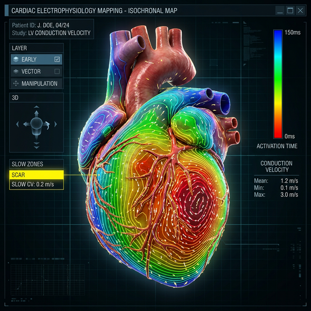

During an electrophysiology (EP) study, a catheter is navigated inside the heart to record localized electrical signals (electrograms). By comparing when a signal arrives at different points, the mapping system calculates the **Local Activation Time (LAT)**. 

If LAT just tells us *when* the wavefront arrived at a specific spot, Propagation Velocity tells us *the speed and direction* it took to get there. In healthy ventricular tissue, this propagation is remarkably fast—usually tearing through the muscle at about 0.5 to 1.0 meters per second. It spreads out evenly, kind of like dropping a pebble into a still pond. 

## Why Does Speed Even Matter? 

The heart’s electrical system runs into trouble when tissue is damaged (whether by a previous heart attack, fibrosis, or underlying disease). Damaged tissue doesn't conduct electricity well. Instead of a smooth, wide highway, the electrical wavefront is forced to navigate narrow, bumpy dirt roads. 

This creates what we call **Slow Conduction Zones**. These zones are essentially the perfect breeding ground for re-entrant arrhythmias, like Ventricular Tachycardia or atypical Atrial Flutter. Imagine the electrical wave getting trapped in a continuous loop. For that loop to actually sustain itself without crashing into its own tail and dying out, it *has* to run through an area of slow propagation.

By mapping exactly how the velocity propagates across the tissue, we can pinpoint:
1. **Fixed Block vs. Functional Block:** Is the tissue completely dead (scar/fixed block), or does it only conduct slowly under certain physiological stresses (functional block)?
2. **The Critical Isthmus:** The narrowest, most vulnerable part of the slow-conduction loop. 

Once the critical isthmus is identified, physicians can target it for **catheter ablation**—delivering RF energy to destroy that tiny corridor, effectively breaking the circuit and restoring normal rhythm.

*Figure 1: An isochronal map showing tightly crowded contour lines indicating a slow conduction zone. (Image generated via Gemini 3.0)*

## How Do We Actually Calculate Velocity? (The Engineering Side)

From a software perspective, calculating an accurate propagation velocity is a massive challenge in signal processing and 3D geometry. Think about it: you have a 3D mesh of a beating heart and a scattering of LAT data points measured by a catheter. How do you accurately guess the speed everywhere else?

1. **Interpolation (Inverse Distance Weighting - IDW):** First, we need a complete activation map. Because we can't measure every millimeter of the heart, some mapping systems use interpolation techniques like IDW or Radial Basis Functions (RBF). This spreads the known LAT values across the dense 3D mesh surface based on the distance between vertices.
2. **Computing the Gradient:** Since velocity has both speed and direction, it's a vector field. If we take the spatial gradient of that interpolated LAT map ($$\nabla LAT$$), we can find exactly which direction time is changing the fastest. The propagation velocity is essentially the inverse of that gradient's magnitude: $$v = 1 / ||\nabla LAT||$$.
3. **Triangulation Algorithms:** Advanced systems group neighboring electrodes into triangles (or cliques) and calculate the apparent wave speed crossing that local plane. This localized math prevents global interpolation errors from skewing the velocity vectors in highly scarred, complex areas.

## Bringing It to Life on the Screen

Taking all that raw vector math and turning it into something a physician can instantly read during a high-stakes procedure requires some really clever data visualization:

*   **Isochronal Maps:** Think of a topographical map, but instead of elevation, the contour lines represent time. Each line (isochrone) marks a specific activation time window (e.g., every 5-10 milliseconds). 
    *   Where the lines are widely spaced, the wave is traveling *fast*. 
    *   Where the lines are tightly crowded together, the wave is traveling *slowly* (like traffic bunching up).
    
*   **Vector Maps:** The software overlays tiny arrows across the 3D heart model. The arrows point in the direction of the wavefront, and their size or color indicates speed. In systems like **Biosense Webster's CARTO 3**, this instantly highlights the pathway of a re-entrant loop by showing "velocity vectors" crowding around a slow-conduction area.

> **Clinical Example:** In a study published in *AHA Circulation: Arrhythmia and Electrophysiology*, researchers demonstrated how these vectors can pinpoint the "critical isthmus" in complex atrial tachycardia by showing a sudden directional shift and speed reduction.

*   **Ripple Mapping & Animation:** Instead of just interpreting static colors, dynamic animations show the wavefront moving across the tissue in real-time. In **Ripple Mapping** (introduced commercially via specialized mapping software), electrogram voltages are displayed as "bars" that protrude from the 3D surface. As the activation moves, these bars rise and fall, creating a ripple effect that the human brain can track much more naturally than a spectrum of colors.

> **Clinical Example:** This is particularly effective for mapping "fractionated" signals in scar tissue—where traditional maps might just show a blur, ripple mapping shows the exact path the signal takes through the surviving channels of healthy muscle.

## Looking Ahead

Historically, trying to calculate accurate propagation velocity was a headache. When you're only sampling sparse points inside a heart chamber, trying to interpolate the speed between them is highly prone to error. 

But today, high-density mapping catheters can sweep up thousands of data points in minutes, giving us unprecedented resolution. Modern algorithms can now automatically highlight abnormal propagation corridors in real-time, pulling the guesswork out of the equation and drastically cutting down procedure times. Understanding exactly how velocity propagates through the heart isn't just an interesting theoretical exercise anymore—it's become the foundation of how we map, track, and ultimately cure complex arrhythmias.